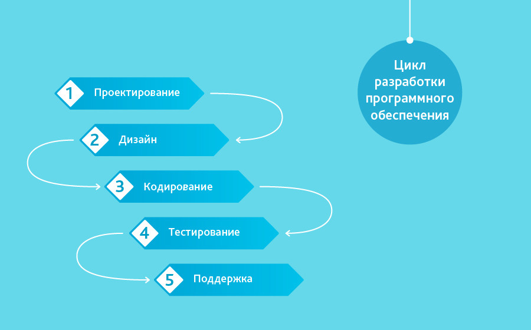

мяу мяу вот [тут](https://notesitmo.github.io/cse-notes/second-course/methods-means-SE/lab-1.html) классно 

# 1. Методологии разработки ПО. Унифицированный процесс.

## 1. «Waterfall Model» (каскадная модель или «водопад»)

<!--  -->

и тд 
https://habr.com/ru/companies/edison/articles/269789/ 

# 2. Требования и их категоризация. Атрибуты требований.

# 3. Язык UML.

The Unified Modeling Language™ (UML®) is a standard visual modeling language intended to be used for

- modeling business and similar processes,

- analysis, design, and implementation of software-based systems

UML is a common language for business analysts, software architects and developers used to describe, specify, design, and document existing or new business processes, structure and behavior of artifacts of software systems.

UML can be applied to diverse application domains (e.g., banking, finance, internet, aerospace, healthcare, etc.) It can be used with all major object and component software development methods and for various implementation platforms (e.g., J2EE, .NET).

UML is a standard modeling language, not a software development process. UML 1.4.2 Specification explained that process:

-  provides guidance as to the order of a team’s activities,

- specifies what artifacts should be developed,

- directs the tasks of individual developers and the team as a whole, and

- offers criteria for monitoring and measuring a project’s products and activities.

UML is intentionally process independent and could be applied in the context of different processes. Still, it is most suitable for use case driven, iterative and incremental development processes. An example of such process is Rational Unified Process (RUP).

UML is not complete and it is not completely visual. Given some UML diagram, we can't be sure to understand depicted part or behavior of the system from the diagram alone. Some information could be intentionally omitted from the diagram, some information represented on the diagram could have different interpretations, and some concepts of UML have no graphical notation at all, so there is no way to depict those on diagrams.

For example, semantics of multiplicity of actors and multiplicity of use cases on use case diagrams is not defined precisely in the UML specification and could mean either concurrent or successive usage of use cases.

Name of an abstract classifier is shown in italics while final classifier has no specific graphical notation, so there is no way to determine whether classifier is final or not from the diagram. 

https://www.uml-diagrams.org/

# 4. Прецеденты использования. UseCase-диаграммы - состав, виды связей.

